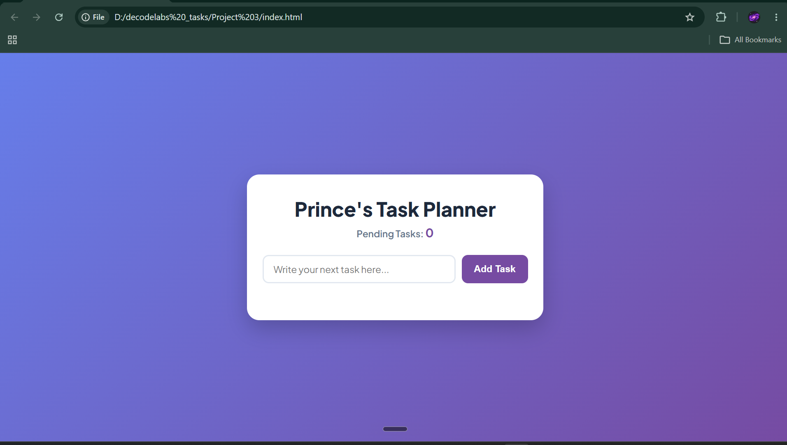
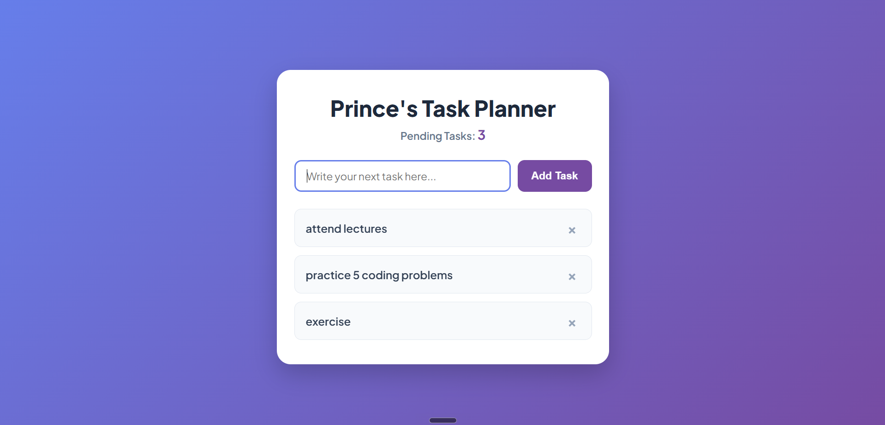
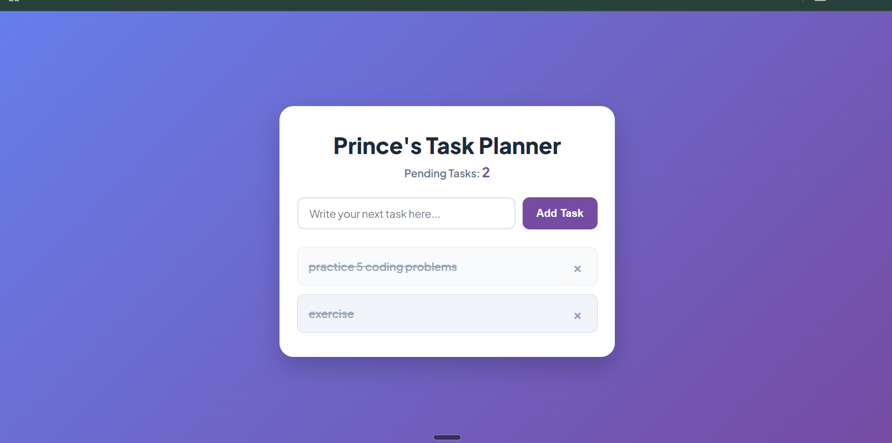

# My Task Planner

## Project Summary
`My Task Planner` is a simple to-do list web application built as a frontend project using HTML, CSS, and JavaScript. It allows users to add tasks, mark tasks as completed, delete tasks, and see a live count of pending items. The app is designed to be lightweight, responsive, and easy to understand for beginners.

## Project Description
This project is based on the concept of a task planner or to-do list. It demonstrates how to build an interactive UI using standard web technologies without any backend server. The interface is clean and centered around a single task entry field, an add button, and a task list area.

The application includes:
- A task entry field where users type a new task
- An "Add Task" button to create the task item
- A dynamic task list showing added tasks
- A pending task counter that updates automatically
- Click-to-complete functionality for each task
- Delete button to remove tasks instantly

## Features
- Add a new task by typing text and clicking the button or pressing Enter
- Mark tasks as completed by clicking the task text
- Delete tasks using the delete (`×`) icon
- Live pending task count
- Responsive layout that works on desktop and mobile widths
- Smooth visual feedback for user interactions

## Technology Stack
- HTML: structure and content
- CSS: styling, layout, and responsive design
- JavaScript: dynamic behavior, DOM manipulation, and event handling

## HTML Technologies Used
The `index.html` file includes:
- `<!DOCTYPE html>` for standards mode
- `<html lang="en">` to declare the document language
- `<meta charset="UTF-8">` for character encoding
- `<meta name="viewport" content="width=device-width, initial-scale=1.0">` for mobile responsiveness
- `<link rel="stylesheet" href="master.css">` to include external CSS
- `<script src="app.js"></script>` to attach JavaScript logic
- Semantic layout elements: `<main>`, `<header>`, `<section>`, `<ul>`, and `<li>`
- Input controls: `<input type="text">` and `<button>`

Special HTML usage:
- `<span>` elements inside each task item are used for the task text and delete icon.
- The `placeholder` attribute provides a hint inside the input field.

## CSS Technologies and Special Styling
The `master.css` file uses:
- Global reset with `* { margin: 0; padding: 0; box-sizing: border-box; }`
- Custom font import from Google Fonts
- `linear-gradient` background for the page
- Flexbox layout for centering content and aligning sections
- Responsive sizing using `max-width` and `clamp()` for fluid headings
- Hover states and transitions for button and task interactions
- Visual state styling with an `.is-completed` class to strike through completed tasks

Important CSS concepts:
- Flexbox for `.input-section` and `.task-item`
- CSS transitions for smooth hover effects
- `border-radius` for rounded UI elements
- Color contrast to keep the interface readable

## JavaScript Technologies and Behavior
The `app.js` file implements:
- DOM selection using `document.querySelector`
- Event listeners with `addEventListener`
- A function `addNewTask()` to create list items dynamically
- Element creation via `document.createElement`
- Class management with `classList.add` and `classList.toggle`
- Input trimming and validation to prevent empty tasks
- Live updates to the task counter
- Keyboard support for the Enter key

Important JS concepts:
- DOM manipulation for building HTML nodes
- Event handling for click and keypress actions
- State tracking with a `count` variable
- Using classes to separate logic from presentation

## How This Works
1. The user types a task in the input field.
2. When the user clicks "Add Task" or presses Enter, the app checks whether the input is empty.
3. If the input contains text, JavaScript creates a new `<li>` item containing:
   - a span for task text
   - a span for the delete icon
4. The task is appended to the task list.
5. The pending task counter increments and updates on screen.
6. Clicking the task text toggles the completed state, applying a strike-through style.
7. Clicking the delete icon removes the task and decrements the counter.

## Procedure
1. Open `index.html` in a modern browser.
2. Type a task description in the input field.
3. Click the `Add Task` button or press Enter.
4. Verify that the task appears in the list and the count increases.
5. Click the task text to mark it as completed.
6. Click the `×` icon to remove the task.
7. Repeat to add, complete, and delete tasks.

## Suggested Flow Chart
A simple flow chart for this app can be represented as:

- Start
- Input task text
- Click add or press Enter
- Validate input
  - If empty: show alert
  - If valid: create task item
- Append task to list
- Increment pending count
- Wait for user actions
  - On task click: toggle completed state
  - On delete click: remove task and decrement count
- End


## Screenshots
Add project screenshots to show the UI and app states.


## Screenshots







```

4. Commit the images and the README together if you store the project in version control.

## Project Notes
- This project is entirely frontend and does not require a backend.
- It is ideal for learning DOM manipulation, event handling, and UI design in vanilla JavaScript.
- The code uses a clear separation of structure (HTML), style (CSS), and behavior (JavaScript).

## Usage
- Open `index.html` in a browser to run the app.
- No installation is required beyond a browser.

## Future Enhancements (Optional)
- Save tasks to local storage so they persist after page refresh.
- Add task edit functionality.
- Add categories, deadlines, or priority labels.
- Add a clear-all button.
